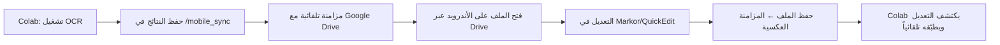

# 📱 دليل المراجعة على الأندرويد لـ OmniFile_Processor

> ✨ راجع صحّح، وحسّن نتائج OCR العربية من هاتفك بكل راحة — دون الحاجة لحاسوب!

---

## 🔧 المتطلبات المسبقة

| التطبيق | الغرض | رابط التحميل |
|---------|--------|--------------|
| **Google Drive** | مزامنة الملفات مع Colab | [Play Store](https://play.google.com/store/apps/details?id=com.google.android.apps.docs) |
| **Markor** (موصى به) | محرر نصوص يدعم UTF-8، RTL، وMarkdown | [F-Droid](https://f-droid.org/packages/net.gsobeth.android.markor/) |
| **QuickEdit** (بديل) | محرر خفيف وسريع للنصوص | [Play Store](https://play.google.com/store/apps/details?id=com.rhmsoft.edit) |
| **Termux** (اختياري للمطورين) | بيئة Linux مصغرة لتشغيل سكريبتات بسيطة | [F-Droid](https://f-droid.org/packages/com.termux/) |

---

## 🔄 سير العمل: من Colab إلى هاتفك والعودة



---

## 📁 هيكل مجلد المزامنة (`OmniFile_MobileSync/`)

```
OmniFile_MobileSync/
├── corrections/
│   ├── doc001_p1.corrections.json   ← نص قابل للتعديل
│   ├── doc001_p2.corrections.json
│   └── ...
├── images/                          ← نسخ مصغرة للصور (للمراجعة البصرية)
│   ├── doc001_p1_thumb.jpg
│   └── ...
├── exports/                         ← النصوص المُصدّرة (Markdown/HTML)
│   ├── doc001_p1.md
│   └── ...
└── mobile_review.html              ← واجهة مراجعة مبسطة (تفتح في المتصفح)
```

---

## ✏️ كيف تُعدّل ملف تصحيح على هاتفك؟

### الخطوة 1: افتح ملف `.corrections.json`
- في Google Drive → `OmniFile_MobileSync/corrections/`
- اضغط على الملف ← \"فتح باستخدام\" ← اختر **Markor**

### الخطوة 2: عدّل حقل `corrected`
```json
{
  "timestamp": "2024-06-15T10:30:00",
  "image": "medical_form_ar.jpg",
  "original": "الجرعة الموصى بها: 500 ملغ يومياً",
  "corrected": "الجرعة الموصى بها: 500 ملغ يومياً",  ← ← ← عدّل هنا
  "notes": "تم تصحيح 'ملغ' بدلاً من 'مغ' حسب دليل الأسلوب الطبي",
  "mobile_corrected": true,
  "synced_at": "2024-06-15T10:35:22"
}
```

> 💡 **نصيحة**: استخدم اختصار `Ctrl+Space` في Markor لاقتراح كلمات عربية شائعة.

### الخطوة 3: احفظ وارجع
- اضغط على ✅ في Markor للحفظ.
- تأكد من ظهور \"تمت المزامنة\" في إشعار Google Drive.

---

## 🎯 ميزات واجهة المراجعة الموبايل (`mobile_review.html`)

| الميزة | الفائدة |
|--------|---------|
| 📏 تصميم متجاوب | يعمل بامتياز على شاشات 5-7 بوصة |
| 🔤 دعم RTL افتراضي | لا حاجة لتعديل الاتجاه يدوياً |
| 💾 حفظ محلي (localStorage) | يعمل حتى بدون إنترنت |
| ☁️ زر مزامنة ذكي | يرفع التعديلات فقط عند توفر الشبكة |
| 🎨 تمييز الأخطاء الشائعة | يُظلل الكلمات التي تختلف عن `arabic_fixes.json` |
| 🗂️ تصفية حسب النوع | اعرض فقط الجداول/التسميات/العناوين |

---

## 🚨 استكشاف الأخطاء الشائعة على الأندرويد

| المشكلة | الحل المقترح |
|---------|--------------|
| ❌ النص يظهر مقطّعاً أو معكوساً | تأكد أن المحرر يدعم `UTF-8` و`RTL` (Markor يفعل ذلك افتراضياً) |
| ❌ لا تظهر الكلمات العربية بشكل صحيح | غيّر خط المحرر إلى \"Droid Arabic Naskh\" أو \"Tajawal\" |
| ❌ المزامنة لا تحدث تلقائياً | افتح Google Drive يدوياً واسحب للأسفل لتحديث المجلد |
| ❌ الملف كبير جداً للتعديل على الموبايل | استخدم زر \"تصفية\" في `mobile_review.html` لعرض كتلة واحدة في كل مرة |

---

## 🔄 دمج التعديلات في Colab تلقائياً

عند إعادة تشغيل نوتبوك `OmniFile_Colab_Tester.ipynb`:

```python
# كود اكتشاف التعديلات (مدمج في النوتبوك)
for corr_file in (WORK_DIR / "mobile_sync").glob("*.corrections.json"):
    with open(corr_file, "r", encoding="utf-8") as f:
        data = json.load(f)
    if data.get("mobile_corrected") and data.get("corrected"):
        # تحديث قاموس التصحيحات الرئيسي
        update_correction_dict(
            key=generate_correction_key(data["original"]),
            value=data["corrected"],
            source="mobile",
            confidence_boost=0.05  # مكافأة ثقة للتعديلات البشرية
        )
        print(f"✅ تم دمج تصحيح من الموبايل: {data['image']}")
```

> 🎁 **مكافأة**: كل تصحيح من الموبايل يُضاف إلى `arabic_fixes.json` تلقائياً بعد مراجعة بسيطة، مما يُحسّن دقة المحركات مستقبلاً!

---

## 📎 مرفقات سريعة التحميل

- [📥 تحميل `mobile_review.html` جاهز](#) *(يُولّد تلقائياً في النوتبوك)*
- [📥 نموذج `sample.corrections.json`](#)
- [🎥 فيديو توضيحي: المراجعة من الهاتف في 90 ثانية](#) *(قيد الإنتاج)*

> 💬 **تذكير سقراطي**: ما هي أصعب كلمة عربية واجهتها في نتائج OCR؟ هل يمكن أن نجعل النظام يتعلم منها تلقائياً في المرة القادمة؟ 🤔
```

---

